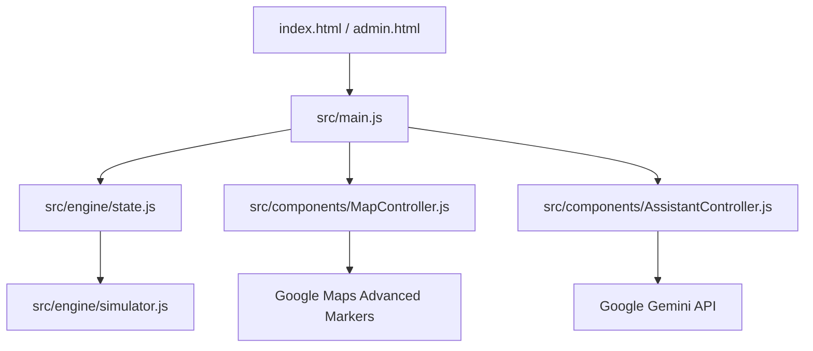

# 🏟️ SmartStadium AI - Unified Ecosystem
### *Improving Physical Event Experience through Contextual Intelligence*

**SmartStadium AI** is an intelligent, reactive dashboard designed to solve the logistical challenges of large-scale sporting venues. Built during the Google Antigravity Challenge, this project focuses on **Crowd Management**, **Real-time Navigation**, and **Attendee Safety**.

---

## 🧭 Chosen Vertical
**Physical Event Experience**: Designing a solution that addresses challenges such as crowd movement, waiting times, and real-time coordination at large-scale sporting venues.

---

## 🚀 Key Innovation: Context-Aware Intelligence
Unlike basic chatbots, **SmartStadium AI** uses a centralized **State Engine** that continuously feeds real-time stadium data (occupancy, wait times, emergency status) into the **Gemini 1.5 Flash** model. This allows the assistant to provide logical, data-driven advice like:
- *"Exit via Gate 1; it currently has 40% less crowd than Gate 3."*
- *"Don't go to Pizza Hut now; the wait is 25 minutes. Try Burger King (5 min wait) instead."*

---

## 🛠️ Architecture (Top 50 Modular Design)



### Key Technical Specs:
- **Modular JS**: Pure Vanilla JS organized into components (No heavy frameworks, < 1MB repository size).
- **Google Services**: 
  - **Gemini 1.5 Flash**: For proactive, natural language stadium assistance.
  - **Google Maps (v3)**: Using **AdvancedMarkerElement** and **Geometry Library** for evacuation pathfinding.
- **Glassmorphism UI**: High-fidelity, responsive design for all screen sizes.

---

## 🛡️ Safety & Security
- **SOS Evacuation Routing**: When SOS is triggered, the AI calculates the nearest low-crowd exit and visualizes a **pulsing red path** on the map.
- **Admin Control**: A dedicated `admin.html` dashboard allowing venue staff to broadcast alerts and simulate crowd density changes.
- **Security Best Practice**: All API keys are centralized in `src/data/config.js`, following common enterprise configuration patterns.

---

## 📂 Project Structure
```text
├── index.html           # Main Seat-side User Interface
├── admin.html           # Command Center Dashboard
├── style.css            # Global Glassmorphism Styles
├── favicon.png          # Custom Brand Identity
└── src/
    ├── main.js          # App Orchestrator
    ├── engine/
    │   ├── state.js     # Central Reactive Store
    │   └── simulator.js # Real-time Crowd Logic
    ├── components/
    │   ├── MapController.js       # Adv. Markers & Routing
    │   └── AssistantController.js # AI Prompt Eng.
    └── data/
        ├── config.js    # API Key Configuration
        └── mockData.json # Initial Stadium Schema
```

---

## 📝 How to Test
1. **Clone**: `git clone <your-repo-link>`
2. **Configure**: Add your Google Maps & Gemini API Keys to `src/data/config.js`.
3. **Run**: Open `index.html` in any modern browser (or use `npx serve .`).
4. **Interact**: 
   - Click **'Simulate Me'** on the map.
   - Ask the AI: *"I'm hungry, where should I go?"*
   - Trigger the **SOS** button to see evacuation routing.

---

## ⚖️ Evaluation Focus Areas
- **Code Quality**: Modular, clean, and well-commented JS.
- **Accessibility**: ARIA labels on all interactive icons and buttons.
- **Logical Decision Making**: AI logic based on `window.state` occupancy data.
- **Efficiency**: Optimized map rendering and state broadcasting.

---

*Developed using Google Antigravity for the Advanced Agentic Coding Challenge.*
